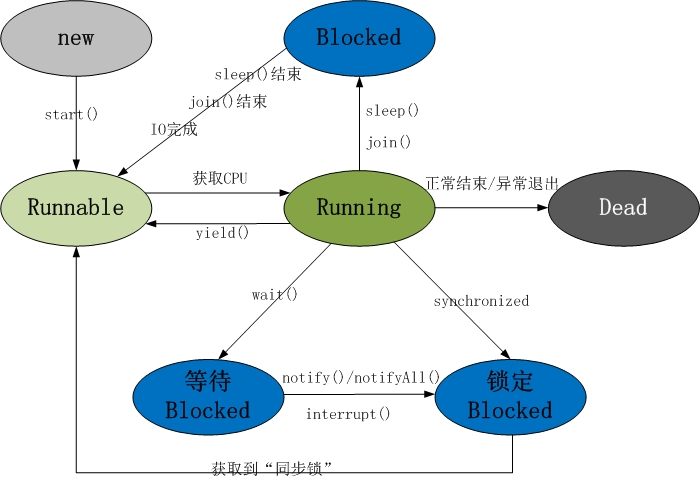

# 1. 线程状态



线程共包括5种状态:

(1) 新建状态(New): 线程对象被创建后，进入了新建状态。
```
Thread thread = new Thread();
```
(2) 就绪状态(Runnable): 也被称为可执行状态。线程对象被创建后，其它线程调用了该对象的start()方法来启动该线程，使其进入就绪状态。处于就绪状态的线程，随时可能被CPU调度执行。
```
thread.start();
```
(3) 运行状态(Running): 线程获取CPU权限进行执行，进入运行状态。需要注意的是，线程只能从就绪状态进入到运行状态。

(4) 阻塞状态(Blocked): 阻塞状态是线程因为某种原因放弃了CPU使用权，暂时停止运行。直到线程进入就绪状态，才有机会转到运行状态。阻塞的情况分为三种：
<pre>
    1.等待阻塞： 通过调用线程的wait()方法，让线程等待某工作的完成；

    2.同步阻塞： 线程在获取synchronized同步锁失败(因为锁被其它线程所占用)，会进入同步阻塞状态；

    3.其他阻塞： 通过调用线程的sleep()或join()方法或发出了I/O请求时，线程会进入到阻塞状态。当sleep()状态超时，join()等待线程终止或超时或者I/O处理完毕时，线程重新进入就绪状态；
</pre>
(5) 死亡状态(Dead): 线程执行完毕或因异常退出了run()方法，该线程结束生命周期

# 2. 常用方法
wait()方法会让当前线程进入等待状态，直到其他线程调用此对象的notify()或notifyAll()方法，同时也会让当前线程释放它所持有的锁；

notify()和notifyAll()方法的作用是唤醒当前对象监视器上的等待线程，notify()是唤醒单个线程(所有等待线程中随机选择一个)，而notifyAll()是唤醒所有线程；

Object中的wait()、notify()等函数，和synchronized一样，会对"对象的同步锁进行操作"，"同步锁"是对象持有的，并且每个对象有且仅有一个，因而notify()和wait()方法等函数定义在Object类；

负责唤醒等待线程的那个线程(唤醒线程)，它只有在获取"该对象的同步锁"(这里的同步锁必须和等待线程的同步锁是同一个)，并且调用notify()或者notifyAll()方法之后，才能唤醒等待线程。虽然等待线程被唤醒，但是它并不能立刻执行，因为唤醒线程还持有"该对象的同步锁"。必须等到唤醒线程释放了"对象的同步锁"之后，等待线程才能获取到"对象的同步锁"进而继续运行；

yield()方法的作用是让步，它能让当前线程由"运行状态"进入到"就绪状态"的同时，从而让其它具有相同优先级的等待线程获取执行权。但是，并不能保证在当前线程调用yield()方法之后，其它具有相同优先级的线程就一定能获得执行权，也有可能是当前线程又进入到"运行状态"继续运行；

yield()和wait()方法的区别是：
<pre>
    1. wait()是让线程由"运行状态"进入到"等待状态"，而yield()是让线程由"运行状态"进入到"就绪状态"；

    2. wait()会让线程释放它所持有对象的同步锁，而yield()方法不会释放锁；
</pre>
sleep()的作用是让当前线程休眠，当前线程会从"运行状态"进入到"休眠状态"，当休眠时间结束后，线程状态从"阻塞状态"变为"就绪状态"，从而等待CPU的调度执行；

当一个线程处于睡眠阻塞时，若被其他线程调用interrupt()方法中断，则sleep()方法会抛出 InterruptedException异常

sleep()和wait()方法的区别是：wait()方法会释放所持有对象的同步锁，而sleep()方法并不会;

setDamon()是设置线程是否为后台线程(守护线程，或精灵线程)的方法: 后台线程与前台线程无异，只是当一个进程中所有前台线程都结束后，无论后台线程是否还处于运行中都将被强制结束，从而使得进程结束程序退出；
```
Thread t = new Thread();

t.setDaemon(true);
```
join()方法表示等待线程执行一定时间或者终止，线程由运行状态进入阻塞状态。也就是说，调用该方法发起子线程的线程，只有等待子线程的运行结束才能由阻塞状态进入就绪状态

# 参考：

1. https://www.cnblogs.com/happy-coder/p/6587092.html

